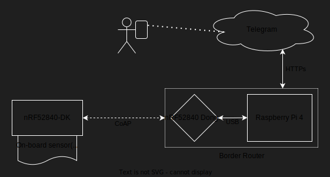

# Project Digitalization (WiSe 2024/25)

This is the repository for the digitalization project 'Text your IoT Device' at the FRA-UAS. Using [RIOT-OS](https://www.riot-os.org/) 
to create an application to control a [_Nordic_ nRF52840-DK](https://www.nordicsemi.com/Products/Development-hardware/nRF52840-DK) device. Providing additional remote access via the 
_Telegram_ bot API. Further, this project uses a Border Router (BR) configuration for network connectivity for the IoT 
device. The BR consists of a [Raspberry Pi 4](https://www.raspberrypi.com/products/raspberry-pi-4-model-b/) and a [_Nordic_ nRF52840-Dongle](https://www.nordicsemi.com/Products/Development-hardware/nRF52840-Dongle). This documentation provides a 
setup guide for the application and the networking, and more in-depth explanations of the implementation itself.

## Our _unique_ approach


<!--
## Content
* [Project Structure](#project-structure)
* [Prerequisites](#prerequisites)
  * [Border Router Setup](#border-router-setup-required)
  * [Dependencies](#dependencies)
  * [Networking Setup](#networking-setup)
  * [Configuration File](#configuration-file)
* [Getting Started](#getting-started)
  * [Quick Start](#quick-start)
  * [Manual Process](#manual-process)
  * [On-Board Shell Commands](#on-board-shell-commands)
  * [Additional Project Commands](#additional-project-commands)
* [Border Router and Websocket Setup (Networking)](#border-router-and-websocket-setup-networking)
  * [nRF52840-Dongle Setup](#nrf52840-dongle-setup)
  * [Raspberry Pi Border Router Setup](#raspberry-pi-border-router-setup)
  * [Raspberry Pi Websocket Setup](#raspberry-pi-websocket-setup)
  * [Check Dongle Connectivity](#check-dongle-connectivity)
  * [More Networking Details](#additional-networking-information)
* [Main Application](#main-application)
  * [Source Classes](#source-classes)
  * [Utility Classes](#utility-classes)
* [Python Websocket](#python-websocket)
* [RIOT-OS Modules](#riot-os-modules)
  * [SAUL ([S]ensor [A]ctuator [U]ber [L]ayer)](#saul-sensor-actuator-uber-layer)
  * [shell](#shell)
  * [ztimer](#ztimer)
  * [gcoap](#gcoap)
  * [udp](#udp)
  * [thread](#thread)
  * [Data Type phydat_t](#data-type-phydat_t)
* [Docker Alternative](#docker-alternative)
* [Troubleshooting](#troubleshooting)
  * [RIOT-OS Git Submodule](#riot-os-git-submodule-not-loading)
  * [nRF Device Locked](#nrf-device-locked)
* [Application Insights and Analysis](#application-insights-and-analysis)
  * [General Commands](#general-commands--tools)
  * [Tool valgrind](#tool-valgrind)
  * [Tool GDB](#tool-gdb)
-->

<details>
  <summary><b><span style="font-size: 2em;">Table of Contents</span></b></summary>
  <b><span style="font-size: 1.5em; margin-left: 36px"><a href="#project-structure">Project Structure</a></span></b>
  <details><summary><b><span style="font-size: 1.5em; margin-left: 25px"><a href="#prerequisites">Prerequisites</a></span></b></summary>
    <ul style="margin-left: 40px; font-size: 1.2em;">
      <li><a href="#border-router-setup-required">Border Router Setup</a></li>
      <li><a href="#dependencies">Dependencies</a></li>
      <li><a href="#networking-setup">Networking Setup</a></li>
      <li><a href="#configuration-file">Configuration File</a></li>
    </ul>
  </details>
  <details><summary><b><span style="font-size: 1.5em; margin-left: 25px"><a href="#getting-started">Getting Started</a></span></b></summary>
    <ul style="margin-left: 40px; font-size: 1.2em;">
      <li><a href="#quick-start">Quick Start</a></li>
      <li><a href="#manual-process">Manual Process</a></li>
      <li><a href="#on-board-shell-commands">On-Board Shell Commands</a></li>
      <li><a href="#additional-project-commands">Additional Project Commands</a></li>
    </ul>
  </details>
  <details><summary><b><span style="font-size: 1.5em; margin-left: 25px"><a href="#border-router-and-websocket-setup-networking">Border Router and Websocket Setup (Networking)</a></span></b></summary>
    <ul style="margin-left: 40px; font-size: 1.2em;">
      <li><a href="#nrf52840-dongle-setup">nRF52840-Dongle Setup</a></li>
      <li><a href="#raspberry-pi-border-router-setup">Raspberry Pi Border Router Setup</a></li>
      <li><a href="#raspberry-pi-websocket-setup">Raspberry Pi Websocket Setup</a></li>
      <li><a href="#check-dongle-connectivity">Check Dongle Connectivity</a></li>
      <li><a href="#additional-networking-information">Additional Networking Information</a></li>
    </ul>  
  </details>
  <details><summary><b><span style="font-size: 1.5em; margin-left: 25px"><a href="#main-application">Main Application</a></span></b></summary>
    <ul style="margin-left: 40px; font-size: 1.2em;">
      <li><a href="#source-classes">Source Classes</a></li>
      <li><a href="#utility-classes">Utility Classes</a></li>
    </ul> 
  </details>
  <b><span style="font-size: 1.5em; margin-left: 36px"><a href="#python-websocket">Python Websocket</a></span></b>
  <details><summary><b><span style="font-size: 1.5em; margin-left: 25px"><a href="#riot-os-modules">RIOT-OS Modules</a></span></b></summary>
    <ul style="margin-left: 40px; font-size: 1.2em;">
      <li><a href="#saul-sensor-actuator-uber-layer">SAUL ([S]ensor [A]ctuator [U]ber [L]ayer)</a></li>
      <li><a href="#shell">shell</a></li>
      <li><a href="#ztimer">ztimer</a></li>
      <li><a href="#gcoap">gcoap</a></li>
      <li><a href="#udp">udp</a></li>
      <li><a href="#thread">thread</a></li>
      <li><a href="#data-type-phydat_t">Data Type phydat_t</a></li>
    </ul> 
  </details>
  <b><span style="font-size: 1.5em; margin-left: 36px"><a href="#docker-alternative">Docker Alternative</a></span></b>  
  <details><summary><b><span style="font-size: 1.5em; margin-left: 25px"><a href="#troubleshooting">Troubleshooting</a></span></b></summary>
    <ul style="margin-left: 40px; font-size: 1.2em;">
      <li><a href="#riot-os-git-submodule-not-loading">RIOT-OS Git Submodule not Loading</a></li>
      <li><a href="#nrf-device-locked">nRF Device Locked</a></li>
    </ul> 
  </details>
  <details><summary><b><span style="font-size: 1.5em; margin-left: 25px"><a href="#application-insights-and-analysis">Application Insights and Analysis</a></span></b></summary>
    <ul style="margin-left: 40px; font-size: 1.2em;">
      <li><a href="#general-commands--tools">General Commands</a></li>
      <li><a href="#tool-valgrind">Tool valgrind</a></li>
      <li><a href="#tool-gdb">Tool GDB</a></li>
    </ul> 
  </details>
</details>


## Project Structure

```
/project-digitalization
├── README.md                     # Documentation
├── Makefile                      # Wrapper Makefile
│
├── src/                          # SOURCE CODE
│   ├── README.md                 # Application Classes Documentation
│   ├── Makefile                  # Main Makefile
│   ├── cmd_control               # Shell Control
│   ├── coap_post                 # COAP POST Client
│   ├── config.ini                # Configuration File
│   ├── configuration             # Configuration Management
│   ├── cpu_temperature           # CPU Temperature
│   ├── led_control               # LED Control
│   ├── main.c                    # Main Application
│   │
│   └── utils/                    # UTILITIES
│       ├── README.md             # Utility Classes Documentation
│       ├── Makefile              # Custom Module Utils
│       ├── error_handler         # Handler Errors
│       └── timestamp_convert     # Convert Timestamps
│
├── websocket/                    # PYTHON WEBSOCKET
│   ├── README.md                 # Websocket Documentation
│   ├── coap_websocket.py         # CoAP/HTTPs Websocket
│   ├── coap_websocket.service    # Websocket Linux Service
│   ├── update_chat_ids.py        # Chat ID Update Script
│   ├── requirements.txt          # Python Requirements
│   └── raspberry_pi_setup.sh     # Automate Websocket Setup
│
├── build.sh                      # Automate Build Process
├── Dockerfile                    # Alternative version with Docker
└── CMakeLists.txt                # CMake project file
```


## Prerequisites

The prerequisites have to be fulfilled before the application can be run. The [Border Router Setup](#border-router-and-websocket-setup-networking)
is the only one of these which CANNOT be automated. The rest of the following prerequisites (Dependencies, Networking
Setup, and Configuration File) are all automated in the [build script](build.sh) ([usage](#quick-start)).

### Border Router Setup (REQUIRED)
For communication with the telegram bot, the nRF52840-DK board requires an internet connection. This
connection is established by following the steps described in [Border Router Setup](#border-router-and-websocket-setup-networking).

### Dependencies

RIOT-OS requires some (linux) packages to function correctly. It is recommended to read the official [RIOT-OS Getting Started](https://doc.riot-os.org/getting-started.html) 
documentation. However, for this application it should be enough to download the following packages, using the appropriate 
package manager for your linux distribution: 
* git
* gcc-arm-none-eabi
* make
* gcc-multilib
* libstdc++-arm-none-eabi-newlib
* openocd gdb-multiarch
* doxygen
* wget
* unzip
* python3
* python3-serial
* python3-venv
* python3-pip
* gnome-terminal

Using APT (Advanced Packaging Tool), you can run this command:
```shell
sudo apt update
sudo apt install git gcc-arm-none-eabi make gcc-multilib libstdc++-arm-none-eabi-newlib openocd gdb-multiarch doxygen wget unzip python3 python3-serial python3-venv python3-pip gnome-terminal
```

### Networking Setup

The application requires an interface (tap0) to be set up beforehand on the linux machine used to build this application
and flash the [nRF52840-Dongle](#nrf52840-dongle-setup) for the [Border Router](#networking--border-router-setup).
```shell
sudo ip tuntap add dev tap0 mode tap user $(whoami) \
sudo ip link set tap0 up \
sudo ip a a 2001:db8::1/48 dev tap0 \
sudo ip r d 2001:db8::/48 dev tap0 \
sudo ip r a 2001:db8::2 dev tap0 \
sudo ip r a 2001:db8::/48 via 2001:db8::2 dev tap0;
```

### Configuration File
Adjust the following settings:
```ini
[telegram]
bot_token = your_telegram_bot_token
chat_ids = firstname_1:chat_id_1,firstname_2:chat_id_2,...,firstname_10:chat_id_10
```
The second part, setting the `firstname:chat_id` is not mandatory, since the [update_chat_ids.py](./websocket/update_chat_ids.py)
python script will add these automatically. However, this script can only get the firstnames and chat IDs from the
Telegram endpoint `/getUpdates` which only shows the latest updates. Therefore, it is recommended to set these up with
initial values. The number of users that can be added here is limited to 10, make sure to assign the correct
`firstname:chat_id` combinations.


## Getting Started

You can either use the build script or manually run the application. All of these commands are intended to be used from 
the directory of this [/project-digitalization](../project-digitalization). You have to clone this repository.

### Quick Start

The [build script](./build.sh) makes using the application as easy as possible. You still have to execute the 
prerequisite [Border Router Setup](#border-router-setup-required) manually, but that is it.

1. Connect the nRF52840-DK board to your linux machine, ensure the board is powered on (status LED).

2. Open the build script, make sure to run as sudo user:
```shell
sudo bash build.sh
```

3. Use the associated numbers to navigate through the script.

### Manual Process

First, make sure you have **all the prerequisites fulfilled**.

1. Set the desired [configuration parameters](src/config.ini).

2. Connect the nRF52840-DK board to your linux machine, ensure the board is powered on (status LED).

3. Build the application:
```shell
make clean all
```

4. Flash the application to the board:
```shell
make flash
```

5. Open the terminal:
```shell
make term
```

All in one (#3 - #5) command:
```shell
make clean all flash term
```

### On-Board Shell Commands

The Console-Thread has to be enabled:
* build script: modify environment variables ➜ toggle `ENABLE_CONSOLE_THREAD`
* config.ini: set `enable_console_thread = 1`

Manage the configuration settings (Use `config help` for more information):
```shell
config <name> <parameter/s>
```

List the current configuration settings:
```shell
config show
```

Send a custom CoAP message (set receiver to "all" to send to every chat):
```shell
coap-send <receiver> <message>
```

Read CPU temperature:
```shell
cpu-temp
```

Control LEDs (brightness can be any value 0-255):
```shell
led <id> <on/off/brighness>
```

List more commands:
```shell
help
```

### Additional Project Commands

List all active RIOT-OS modules:
```shell
make info-modules
```


## Border Router and Websocket Setup (Networking)

The IoT device we are using in this project (nRF52840-DK) has 6LoWPAN (no WLAN or LAN) connectivity only, as IoT devices
usually do. Therefore, we have to use a Border Router (BR) which can connect to our device and to a "normal" network. 
For this, we are using a Raspberry Pi and the nRF52840-Dongle. These two combined are the BR. More information
[here](#additional-networking-information).

**The [Dependencies](#dependencies) and [Networking Setup](#networking-setup) prerequisites have to be fulfilled
before this setup.**

These are the **mandatory** steps to set up networking for the application: 
1. Set up [nRF52840-Dongle](#nrf52840-dongle-setup) (Linux machine)
2. Set up [Raspberry Pi for Border Router](#raspberry-pi-border-router-setup) functionality (Linux machine & Raspberry Pi)
3. Set up [Raspberry Pi for Websocket](#raspberry-pi-websocket-setup) functionality (Raspberry Pi)

### nRF52840-Dongle Setup

The nRF52840-Dongle setup can only be done on a x64/x86-based Linux machine. Because we need the tool [nRF Util](https://www.nordicsemi.com/Products/Development-tools/nRF-Util) 
to flash the dongle and this tool is NOT available for ARM-based machines.

Therefore, **this setup cannot be done on the Raspberry Pi**.

1. Get the AllRIOT version of the `gnrc_border_router` example:
```shell
git clone https://github.com/AllRIOT/RIOT.git AllRIOT
```

2. Navigate to the `gnrc_border_router` directory:
```shell
cd AllRIOT/examples/gnrc_border_router
```

3. Plug the nRF52840-Dongle into any USB port of your device (the x64/x86 Linux machine).

4. Build and flash the `gnrc_border_router` example to the nRF52840-Dongle:
```shell
BOARD=nrf52840dongle make clean all flash
```

5. **The nRF52840-Dongle is now set up.**

### Raspberry Pi Border Router Setup

This setup has to be run to prepare the Border Router functionality of the Raspberry Pi.

1. Plug the nRF52840-Dongle into any USB port of the Raspberry Pi.

2. Connect the Raspberry Pi to your local network (e.g., via ethernet) and power. The rest of this setup assumes an
   ethernet connection.

3. Locate the Raspberry Pi's IP address in your local network (you can use any tool, here we use arp-scan):
```shell
# Get your ethernet interface name with ifconfig
ifconfig
# Outputs all the interfaces with their configuration
# Ethernet interfaces will usually start with "en"
<interface1-name>: ...
<interface2-name>: ...
eno1:
# Scan the ethernet interface (here: eno1) locally with -l
sudo arp-scan -I <ethernet-interface-name> -l
# Outputs a list off all devices
<ip-address> <mac-address> <vendor-name>
192.168.0.213 d8:3a:dd:2b:61:79 Raspberry Pi Trading Ltd
```

4. Connect to the Raspberry Pi via ssh with the username "riot" and enter the correct password:
```shell
ssh riot@192.168.0.213
```

5. If you are in the correct place, your console should look like this:
```shell
riot@6lbr-8:~ $
```

6. Clone this project on the Raspberry Pi
```shell
git clone https://github.com/rovi1013/project-digitalization.git
```

7. **Now the Raspberry Pi is set up and can be used as a Border Router.**

### Raspberry Pi Websocket Setup

This setup intended to be done from [/websocket](./websocket) on the Raspberry Pi.

This setup prepares the CoAP/HTTPs websocket to run automatically on the Raspberry Pi on boot using a Linux service. 
This can be done [automatically](websocket/raspberry_pi_setup.sh) or [manually](#manual-raspberry-pi-websocket-setup). More information on the websocket can be found here: 
[Websocket Documentation](websocket/README.md).

#### Automatic Raspberry Pi Websocket Setup

Execute the script as sudo user and follow the instructions:
```shell
sudo bash raspberry_pi_setup.sh
```

#### Manual Raspberry Pi Websocket Setup

If you haven't cloned the project to the Raspberry Pi already ([Step 2](#raspberry-pi-border-router-setup)), do so now.

1. Install python dependencies on Raspberry Pi (virtual python env has to be in .venv):
```shell
cd project-digitalization/websocket
python -m 'venv' .venv
source .venv/bin/activate
pip install -r requirements.txt
```

2. Modify  mode to make sure user 'riot' can execute python script:
```shell
sudo chown -R riot:riot coap_websocket.py
sudo chmod -R u+rwx coap_websocket.py
```

3. Enable autorun with coap_websocket.service, copy this service file to the correct location:
```shell
sudo cp coap_websocket.service /etc/systemd/system/
```

4. Add the following lines to /etc/rc.local:
```shell
sleep 1
ip -6 addr add 2001:470:7347:c810::1234/64 dev usb0
```

5. Rename the [config.ini.template](./src/config.ini.template) to config.ini and enter your Telegram bot token:
```ini
[telegram]
bot_token = your_telegram_bot_token
```

6. Reload the daemon, enable and start the service:
```shell
# Reload daemon
sudo systemctl daemon-reload
# Enable and Start Service
sudo systemctl enable coap_server.service
sudo systemctl start coap_server.service
```

Additional management commands for the service:
```shell
# Check Service Status
sudo systemctl status coap_server.service
# Stop Service
sudo systemctl stop coap_server.service
# Restart Service
sudo systemctl restart coap_server.service
```

### Check Dongle Connectivity

As mentioned above (see [Border Router Setup](#border-router-setup)) the nRF52840-DK board is only directly connected
to the nRF52840-Dongle. This section explains how this connection can be established. This setup has to be done every
time you want to use the Border Router. **This section requires the [Raspberry-Pi Setup](#raspberry-pi-setup) &
[nRF52840-Dongle Setup](#nrf52840-dongle-setup).**

#### Raspberry-Pi / nRF52840-Dongle Terminal Setup
1. Connect to the raspberry-pi via ssh and enter the password:
```shell
ssh riot@<network-ip-addr>
```
2. In the raspberry-pi shell (riot@6lbr-8) navigate to the RIOT directory:
```shell
cd ~/project-digitalization/RIOT
```
3. Open the Border Router terminal on the nRF52840-Dongle:
```shell
dist/tools/pyterm/pyterm -p /dev/ttyACM0
```
NOTE: Do not use `make term` from the `gnrc_border_router` directory!
4. Get the global ip address of the nRF52840-Dongle; if there are multiple interfaces, you can differentiate them by the
   other parameters. For example, the correct `Link type` is `wireless`. Also make sure to get the IPv6 address with
   `scope: global`.
```shell
> ifconfig
# Iface  6  HWaddr: 6E:0D:84:59:FC:9B 
#           L2-PDU:1500  MTU:1500  HL:64  RTR  
#           Source address length: 6
#           Link type: wired
#           inet6 addr: fe80::6c0d:84ff:fe59:fc9b  scope: link  VAL
#           inet6 addr: aaaa::6c0d:84ff:fe59:fc9b  scope: global  VAL
#           inet6 group: ff02::2
#           inet6 group: ff02::1
#           inet6 group: ff02::1:ff59:fc9b
#           
# Iface  7  HWaddr: 26:3E  Channel: 26  NID: 0x23  PHY: O-QPSK 
#           Long HWaddr: E6:76:0A:9B:E2:59:A6:3E 
#            State: IDLE 
#           ACK_REQ  L2-PDU:102  MTU:1280  HL:64  RTR  
#           RTR_ADV  6LO  IPHC  
#           Source address length: 8
#           Link type: wireless
#           inet6 addr: fe80::e476:a9b:e259:a63e  scope: link  VAL
#           inet6 addr: 2001:470:7347:c318:e476:a9b:e259:a63e  scope: global  VAL
#           inet6 group: ff02::2
#           inet6 group: ff02::1
#           inet6 group: ff02::1:ff59:a63e
#    
```
Correct IPv6 address from this example: `2001:470:7347:c318:e476:a9b:e259:a63e`

#### nRF52840-DK Board Terminal Setup
1. Connect the nRF52840-DK board to your (Linux) PC.
2. Start the application as described in [Getting Started](#getting-started).
3. Get the global ip address of the nRF52840-DK board; make sure to get the IPv6 address with `scope: global`.
```shell
> ifconfig
# Iface  6  HWaddr: 39:2F  Channel: 26  NID: 0x23  PHY: O-QPSK 
#           Long HWaddr: A6:1D:B3:F5:52:12:39:2F 
#            State: IDLE 
#           ACK_REQ  L2-PDU:102  MTU:1280  HL:64  6LO  
#           IPHC  
#           Source address length: 8
#           Link type: wireless
#           inet6 addr: fe80::a41d:b3f5:5212:392f  scope: link  VAL
#           inet6 addr: 2001:470:7347:c318:a41d:b3f5:5212:392f  scope: global  VAL
#           inet6 group: ff02::1
#           
#           Statistics for Layer 2
#             RX packets 11  bytes 566
#             TX packets 17 (Multicast: 8)  bytes 0
#             TX succeeded 17 errors 0
#           Statistics for IPv6
#             RX packets 10  bytes 696
#             TX packets 17 (Multicast: 8)  bytes 1048
#             TX succeeded 17 errors 0
#
```
Correct IPv6 address from this example: `2001:470:7347:c318:a41d:b3f5:5212:392f`

#### Simple Ping between Dongle and Board
From the Border Router terminal ([this](#raspberry-pi--nrf52840-dongle-terminal-setup)):
```shell
ping <board-ip-address>
# With the example address from above:
ping 2001:470:7347:c318:a41d:b3f5:5212:392f
```

From the board terminal ([this](#nrf52840-dk-board-terminal-setup)):
```shell
ping <border-router-ip-address>
# With the example address from above:
ping 2001:470:7347:c318:e476:a9b:e259:a63e
```

### Additional Networking Information

As already established, the combination of the Raspberry Pi and nRF52840-Dongle are the Border Router (BR) in this setup.
Generally, every device that can connect to both a 6LoWPAN network and a more "standard" network like WLAN or ethernet
could be used as a BR. In the case of this project, we are using the nRF52840-Dongle to establish a 6LoWPAN
connection with the nRF52840-DK board. The Raspberry Pi only provides an interface to allow the dongle a connection to
either WLAN or ethernet. Specifically, the USB ports of the Raspberry Pi provide this interface. The 6LoWPAN connection 
between the 2 boards is established automatically, in a real world application such a BR would connect many 
IoT devices to one network.

> On this RIOT BR two interfaces are present. A wired interface represents the serial link between Linux and your mote. 
> A wireless interface represents the 802.15.4 radio link. <br>
> <cite>From [RIOT-OS border router example](https://github.com/AllRIOT/RIOT/tree/master/examples/gnrc_border_router)</cite>




## Main Application

The main application running on the nRF52840-DK using RIOT-OS.

### Source Classes

These classes provide the main functionality for the application and are located in [/src](./src/utils). For further 
information on their functionality, see [Classes README](./src/README.md).

### Utility Classes

These Classes are additional utilities used in the application and are located in [/utils](./src/utils). They are 
included in the application as a module. For further information on their functionality, see [Utilities README](./src/utils/README.md).


## Python Websocket

The websocket running separately used to convert the messages, coming from the nRF52740-DK board, into HTTPs requests
for the telegram bot. The websocket is located in [/websocket](./websocket), further information on its functionality
can be found in the [Websocket README](./websocket/README.md).


## RIOT-OS Modules

A short description of each module, and why it was used in the project.

### SAUL ([S]ensor [A]ctuator [U]ber [L]ayer)

The SAUL module provides a unified abstraction for accessing sensors and actuators. It simplifies interaction with
devices by exposing a common API for reading and writing values. Ensure compatibility with multiple hardware
devices using a consistent interface.

More information here: [SAUL Driver](https://doc.riot-os.org/group__drivers__saul.html) documentation.

### shell

The shell module provides a command-line interface for interacting with the board. It allows users to issue commands,
like controlling LEDs or reading sensor values. It provides a simple interface for testing and debugging within
the project.

More information here: [shell](https://doc.riot-os.org/group__sys__shell.html) documentation.

### ztimer

The ztimer module provides a high level timer abstraction of hardware timers. It is used to get the current application 
uptime. In the CoAP thread, we use this module to let the thread sleep for a specified amount of time.

More information here: [ztimer](https://doc.riot-os.org/group__sys__ztimer.html) documentation.

### gcoap

The gcoap module is a high level interface for CoAP messaging. While this also provides CoAP server operation 
capabilities in this application, we only use the client operations. The CoAP client is used to send and receive  
messages to and from the CoAP websocket.

More information here: [gcoap](https://doc.riot-os.org/group__net__gcoap.html) documentation.

### udp

The udp module is part of the [generic (GNRC) network stack](https://doc.riot-os.org/group__net__gnrc.html) of RIOT. 
It implements the UDP protocol which is used for the networking of this application.

More information here: [udp](https://doc.riot-os.org/group__net__gnrc__udp.html) documentation.

### thread

The thread module allows for multi-threading in RIOT applications. This module is used to create threads and assign 
different priority levels to each of them.

More information here: [thread](https://doc.riot-os.org/group__core__thread.html) documentation.

### Data Type phydat_t

phydat_t is a structure that standardizes the representation of physical data across sensors and actuators.

<table>
  <thead>
    <tr>
        <th style="text-align: left;">Data Field</th>
        <th style="text-align: left;">Description</th>
        <th style="text-align: left;">Example Value</th>
        <th style="text-align: left;">Data Type</th>
    </tr>
  </thead>
  <tbody>
    <tr>
        <td>val[ ]</td>
        <td>Stores (up to) 3 values	</td>
        <td>4200,0,0</td>
        <td>int16_t</td>
    </tr>
    <tr>
        <td>unit</td>
        <td>The (physical) unit of the data</td>
        <td>UNIT_TEMP_C</td>
        <td>uint8_t</td>
    </tr>
    <tr>
        <td>scale</td>
        <td>The scale factor (10^factor)</td>
        <td>-2</td>
        <td>int8_t</td>
    </tr>
  </tbody>
</table>

The example values from the table above result in 4200 = temp * 10^(-2) UNIT_TEMP_C which means temp = 42°C. Some
sensors provide multidimensional data (e.g., accelerometer) which is why the data field `val[]` is 3-dimensional.

More information here: [phydat_t structure](https://doc.riot-os.org/structphydat__t.html) documentation.


## Docker Alternative

It is possible to run the application in a docker container. This is limited to the `BOARD=native` environment, which
requires mocking of sensor data. This will hide possible issues with e.g., reading real sensor data or getting sensor
information. This can be used on Windows machines to run the application.

Make sure the docker daemon is running.

To build the image, use the [Dockerfile](./Dockerfile):
```shell
docker build -t riot-app .
```

Then you can run the container:
```shell
docker run -it riot-app
```


## Troubleshooting

Some common errors and possible solutions.

### RIOT-OS Git Submodule not Loading

The RIOT-OS git repository is included in this project as a submodule, must be downloaded to use this application.
Sometimes this module won't load automatically when cloning the project. This can be resolved by running the following
commands (from [/project-digitalization](../project-digitalization)).
```shell
git submodule init
git submodule update
```

### nRF Device Locked

After rebooting, the nRF device sometimes is locked. Using the [build script](./build.sh) this is done automatically. 
But you can also manually unlock the device using `openocd`:

```shell
openocd -c 'interface jlink; transport select swd;
source [find target/nrf52.cfg]' -c 'init'  -c 'nrf52_recover'
```


## Application Insights and Analysis

An overview of the different tools and analysis performed on this application to provide the best result possible and 
avoid common mistakes and causes for errors.

### General Commands / Tools

Get the PID (process id) of the application (has to be running):
```shell
ps aux | grep project
# "project" is the partial name search for the process
# The number in the second column of the output is the PID
# USER PID %CPU %MEM VSZ RSS TTY STAT START TIME COMMAND
```

Use `strace` to get the "output" of the process by id:
```shell
strace -p <process_id>
```

Debug the application with [GDB](#tool-gdb):
```shell
sudo gdb --pid=<process_id>
# Opens gbd console
# Set breakpoint at function_name
b function_name
# Run the app
run
# Go though the execution
next
```

### Tool valgrind

This tool allows analyzing the application, especially the ability to discover memory related issues. Only works for
x86, x86_64 and ARM architectures in environments supporting virtual memory; this unfortunately also means we can only
check our application build with `BOARD=native`.

Run valgrind:
```shell
valgrind --tool=memcheck --track-origins=yes --trace-children=no --run-libc-freeres=yes --demangle=yes \
--show-below-main=no --workaround-gcc296-bugs=no --undef-value-errors=yes ./src/bin/native/project-digitalization.elf 
```

Valgrind [Documentation](https://valgrind.org/docs/manual/manual-intro.html).

### Tool GDB

The GNU Project Debugger (GDB) is a powerful tool for debugging applications in various programming languages, 
primarily C and C++. It allows inspecting and controlling a program's execution, set breakpoints, examine memory, 
and diagnose a variety of issues. 

You can either start it using the PID ([get process id](#general-commands--tools)):
```shell
sudo gdb --pid=<process_id>
```

Or start it using the compiled application (.elf in src/bin/...):
```shell
gdb src/bin/.../project-digitalization.elf
```

Now you can:
* Set breakpoints with `break function_name`
* Start debugging with `run`
* Continue after breakpoint with `continue`
* Debug the application step-by-step with `next`
* Step into a function call with `step`
* Inspect variables with `print var_name` or `info var_name`
* Modify variables with `set var_name = value`
* Trace variable changes with `watch var_name`
* Inspect memory with `x/<repeat><format><size> <address>`
  * repeat: Number of entries to display
  * format: Display format (x = hex, d = decimal, s = string, ...)
  * size: Data size (b = byte, h = halfword, w = word, g = giant/8 bytes)
  * address: Memory location (can be variable, pointer, register, or explicit address)
* Check memory allocation and freeing with `break malloc` and `break free`
* View stack memory with `info locals`
* View cpu registers with `info registers`
* And much more

GDB [Documentation](https://www.sourceware.org/gdb/documentation/)


## _Telegram_ Bot Integration

### Set Up a Bot

1. Open _Telegram_
2. Search for "BotFather" and start a new chat with it
3. Use ``/newbot`` to create a new bot
4. Use the provided token to access the HTTP API

The bot "BotFather" is used to create and manage bot accounts.

_Telegram_ Bot API [Documentation](https://core.telegram.org/bots/api)

### Bot Description

TODO
<!---Change to match real usage 
This bot is used to send and receive messages to and from a small (proof-of-concept) IoT device. These messages can be 
used to control the device running on RIOT-OS. See "Commands" for a list of all available controls.

### Bot Commands

Turn on an LED:
```shell
led <1-4> <1-4> ... on
```

Turn off an LED:
```shell
led <1-4> <1-4> ... off
```

Toggle an LED:
```shell
led <1-4> <1-4> ... toggle
```

You can control the LEDs by their associated number written on the board (LED1, LED2, LED3, LED4 -> \<1-4>).
Inferentially the maximum number of target LEDs for the commands above is 4.
--->

