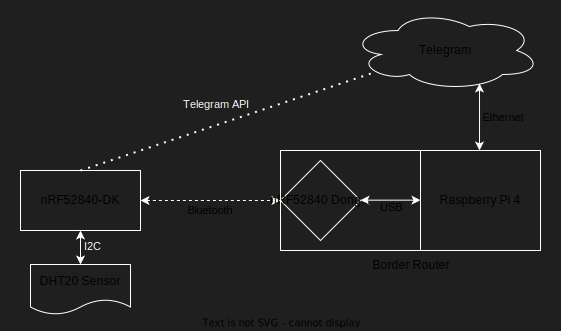

# Project Digitalization (WiSe 2024/35)

This is the repository for the digitalization project at the FRA-UAS. Using RIOT-OS to create a small application to 
control a _Nordic_ nRF52840 (DK) device. Providing additional remote access via the _Telegram_ bot API. 


## Prerequisites

### RIOT-OS Prerequisites

RIOT-OS requires some (linux) packages to function correctly. It is recommended to read the official 
[RIOT-OS Getting Started](https://doc.riot-os.org/getting-started.html) documentation. However, for the purpose of this 
application it should be sufficient to download the following packages, using the appropriate package manager for your
linux distribution: 
* git
* gcc-arm-none-eabi
* make
* gcc-multilib
* libstdc++-arm-none-eabi-newlib
* openocd gdb-multiarch
* doxygen
* wget
* unzip
* python3-serial

With Ubuntu (using apt) you can run this command:
```shell
sudo apt install git gcc-arm-none-eabi make gcc-multilib libstdc++-arm-none-eabi-newlib openocd gdb-multiarch doxygen wget unzip python3-serial
```

### RIOT-OS Submodule

RIOT-OS is included in this project as a submodule, must be downloaded in order to use this application. Sometimes 
this modules won't load automatically when cloning the project. This can be resolved by running the following 
commands (from [/project-digitalization](../project-digitalization)).
```shell
git submodule init
git submodule update
```

### Network Connectivity

The application requires an interface (tap0) to be set up beforehand:
```shell
sudo ip tuntap add dev tap0 mode tap user $(whoami)
sudo ip link set tap0 up
```

#### BORDER ROUTER SETUP (REQUIRED)
For communication with the telegram bot the nRF52840-DK board requires an internet connection. This 
connection is established by following the steps described in [Border Router Setup](#border-router-setup).


## Usage

### Setup

1. Connect the nRF52840-DK board to Your PC and ensure the board is powered on (status LED).
2. Build and Flash the Application.

Navigate to the project directory:
```shell
cd project-digitalization
```

Build the application (this includes RIOT-OS) and open a terminal to the board:
```shell
make clean all flash term
```

### Shell Commands

Control LEDs (brightness can be any value 0-255):
```shell
led <id> <on/off/brighness>
```

Read CPU temperature:
```shell
cpu-temp
```

Configure and list network interfaces:
```shell
ifconfig
```

List more commands:
```shell
help
```


### Useful commands

Unlocking the nrf device:
```shell
openocd -c 'interface jlink; transport select swd;
source [find target/nrf52.cfg]' -c 'init'  -c 'nrf52_recover'
```

Using the "native" board for development:

```shell
BOARD=native make clean all term
```

List all available RIOT modules:

```shell
make info-modules
```


## Project Structure

```shell
project/digitalization
├── README.md                     # Documentation
├── Makefile                      # Wrapper Makefile
├── src/
│   ├── README.md                 # Application classes Documentation
│   ├── Makefile                  # Main Makefile
│   ├── main.c                    # Main application file
│   ├── cmd_control               # Shell control
│   ├── cpu_temperature           # CPU temperature
│   ├── led_control               # LED control
│   ├── coap_control              # COAP client
│   └── utils/
│       ├── Makefile              # Custom module utils
│       ├── timestamp_convert     # Convert timestamps to hh:mm:ss
│       └── error_handler         # Handler error messaging
├── websocket/
│   ├── README.md                 # Websocket Documentation
│   ├── websocket.py              # Main Websocket file
│   ├── requirements.txt          # Python requirements
│   └── .env                      # Secrets storage file
├── Dockerfile                    # Alternative version with Docker
└── CMakeLists.txt                # CMake project file
```

## Main Application

The main application running on the nRF52840-DK using RIOT-OS.

### Main Classes

These classes provide the main functionality for the application and are located in [/src](./src/utils). For further 
information on their functionality see [Classes README](./src/README.md).

### Utility Classes

These Classes are additional utilities used in the application and are located in [/utils](./src/utils). They are 
included into the application as a module. For further information on their functionality see [Utilities README](./src/utils/README.md).


## Python Websocket

The websocket running separately used to convert the messages, coming from the nRF52740-DK board, into https requests
for the telegram bot. The websocket is located in [/websocket](./websocket), further information on its functionality
can be found in the [Websocket README](./websocket/README.md).


## RIOT-OS Modules

A short description of each module, its purpose, why it was used, and where in the project it is utilized.

### Module SAUL ([S]ensor [A]ctuator [U]ber [L]ayer)

The SAUL module provides a unified abstraction for accessing sensors and actuators. It simplifies interaction with 
devices by exposing a common API for reading and writing values. Ensure compatibility with multiple hardware 
devices using a consistent interface.

* led_control:
  * Uses saul_reg_write to set LED brightness.
  * Uses saul_reg_find_nth to locate the correct LED by its SAUL registry ID.
* cpu_temperature:
  * Uses saul_reg_read to fetch CPU temperature data.

More information here: [SAUL Driver](https://doc.riot-os.org/group__drivers__saul.html) documentation.

### Data Type phydat_t

phydat_t is a structure that standardizes the representation of physical data across sensors and actuators.

<table>
  <thead>
    <tr>
        <th style="text-align: left;">Data Field</th>
        <th style="text-align: left;">Description</th>
        <th style="text-align: left;">Example Value</th>
        <th style="text-align: left;">Data Type</th>
    </tr>
  </thead>
  <tbody>
    <tr>
        <td>val[ ]</td>
        <td>Stores (up to) 3-dimensional values	</td>
        <td>0.42,0,0</td>
        <td>int16_t</td>
    </tr>
    <tr>
        <td>unit</td>
        <td>The (physical) unit of the data</td>
        <td>UNIT_TEMP_C</td>
        <td>uint8_t</td>
    </tr>
    <tr>
        <td>scale</td>
        <td>The scale factor (10^factor)</td>
        <td>-2</td>
        <td>int8_t</td>
    </tr>
  </tbody>
</table>

The example values from the table above result in 0.42 = temp * 10^(-2) UNIT_TEMP_C which means temp = 42°C.

Some sensors provide multidimensional data (e.g. accelerometer) which is why the data field val[ ] is 3-dimensional.

More information here: [phydat_t structure](https://doc.riot-os.org/structphydat__t.html) documentation.

### Module Shell

The shell module provides a command-line interface for interacting with the board. It allows users to issue commands, 
like controlling LEDs or reading sensor values. It provides a simple interface for testing and debugging within 
the project.

* cmd_control:
  * Registers all shell commands (e.g., led, cpu-temp) and dispatches them to their respective handlers.

More information here: [phydat_t structure](https://doc.riot-os.org/group__sys__shell.html) documentation.

<!---
TODO: FUTURE MODULES
--->

### sock.h

A network API for applications and libraries, used to create custom HTTP functionality with the UDP submodule.
See [link](https://doc.riot-os.org/group__net__sock__udp.html).

### jsmn.h
JSON parser library. See [link](https://doc.riot-os.org/group__pkg__jsmn.html).


## Application Insights and Analysis

An overview of the different tools and analysis performed on this application in order to provide the best result
possible and avoid common mistakes and causes for errors.

### Tool valgrind

This tool allows to analyse the application, especially the ability to discover memory related issues. Only works for
x86, x86_64 and ARM architectures in environments supporting virtual memory, this unfortunately also means we can only
check our application build with `BOARD=native`.

Run valgrind:
```shell
valgrind --tool=memcheck --track-origins=yes --trace-children=no --run-libc-freeres=yes --demangle=yes \
--show-below-main=no --workaround-gcc296-bugs=no --undef-value-errors=yes ./src/bin/native/project-digitalization.elf 
```

Valgrind [Documentation](https://valgrind.org/docs/manual/manual-intro.html).

### Tool dive

This tool allows to analyse docker image layers.

Run `dive`:
```shell
docker run --rm -it \
    -v /var/run/docker.sock:/var/run/docker.sock \
    wagoodman/dive:latest riot-app:latest
```

Dive [Documentation](https://github.com/wagoodman/dive).


## Border Router Setup

The IoT device we are using in this project (nRF52840) has BLE (no WLAN or LAN) connectivity only, as these devices 
usually do. Therefore, we have to use a border router which can connect to our device and to a "normal" network. For 
this we are using a raspberry-pi and the nRF52840-Dongle. These two together can be seen as the border router.

The first thing to do is to set up the raspberry-pi and the nRF52840-Dongle. After this is done you can connect the
nRF52840-DK to the nRF52840-Dongle and then establish internet connectivity. 

1. Set up raspberry-pi and nRF52840-Dongle (once)
2. Connect nRF52840-DK board and nRF52840-Dongle (every time)
3. AUTOMATICALLY: Establish internet connectivity

**Network Diagram**




### Raspberry-Pi / nRF52840-Dongle Setup

This setup has to be run once (and only once) in order to prepare the border router functionality.

1. Plug the nRF52840-Dongle into any USB port of the Raspberry-Pi.
2. Connect the Raspberry-Pi to your local network (here via ethernet) and power. The rest of this setup assumes an 
ethernet connection.
3. Locate the Raspberry-Pi's IP address in your local network (you can use any tool, here we use arp-scan):
```shell
# Get your ethernet interface name with ifconfig
ifconfig
# Outputs all the interfaces with their configuration
# Ethernet interfaces will usually start with "en"
<interface1-name>: ...
<interface2-name>: ...
eno1:
# Scan the ethernet interface (here: eno1) locally with -l
sudo arp-scan -I <ethernet-interface-name> -l
# Outputs a list off all devices
<ip-address> <mac-address> <vendor-name>
192.168.0.213 d8:3a:dd:2b:61:79 Raspberry Pi Trading Ltd
```
4. Connect to the Raspberry-Pi via ssh with username "riot" and enter correct password:
```shell
ssh riot@192.168.0.213
```
5. If you are in the correct place your console should look like this:
```shell
riot@6lbr-3:~ $
```
6. Get the border router setup from RIOT:
```shell
git clone https://github.com/AllRIOT/RIOT.git AllRIOT
```
7. Install the RIOT-OS requirements (may need to remove gcc-multilib):
```shell
sudo apt install git gcc-arm-none-eabi make gcc-multilib libstdc++-arm-none-eabi-newlib openocd gdb-multiarch doxygen wget unzip python3-serial
```
8. Now the Raspberry-Pi is set up and can be used as a border router.


<!---
TODO: REWRITE THIS SECTION

IPv6 lowpan to connect BLE (Bluetooth low energy) of nrf board to standard ipv6, while saving a lot of size for the transmission (e.g. IPv6 header size).
gnrc_networking make all term for interface, use variable PORT (from makefile) to connect if instance already running
Connect to internet:
dist/tools/tapsetup/tapsetup -u \<interface> ; use ethernet as interface to add this to the network

### Raspberry-Pi Setup

ip addr show or /sbin/ifconfig

https://unix.stackexchange.com/questions/188367/get-names-of-devices-on-the-network

-> look up address range

sudo nmap -sn 192.168.0.1/24

= gives every device connected to this network

ssh to device -> authenticate with username and password

riot@6lbr-3

(maybe important?):
install kea on raspberry-pi (sudo apt install kea)

https://kea.readthedocs.io/en/latest/arm/dhcp6-srv.html

TODO: HOW TO SETUP RPI.

### nRF52840-Dongle Setup

nrfutil version >=6.1.1 required

-> requires Python >=3.7, <3.11 (https://pypi.org/project/nrfutil/)

Change Makefile in RIOT/examples/gnrc_border_router/Makefile according to
https://teaching.dahahm.de/teaching/ss23/project/2023/05/06/nrf52840dongle_6lbr.html
Use gnrc_border_router from AllRIOT/RIOT repository

set up dongle (from AllRIOT/examples/gnrc_boarder_router) on Linux machine (PC: AMD64 only, no ARM):
BOARD=nrf52840dongle make all flash term

make package (for nrf52840dongle)

find usb device (lsusb), maybe need to push reset button, find target usb port (/dev/ttyACM*, in our case /dev/ttyACM0)

create .zip (for flash): nrfutil pkg generate --hw-version 52 --sd-req 0x00 --application gnrc_border_router.hex --application-version 1 gnrc_border_router.hex.zip
(explain variables!)

flash the device with .zip: nrfutil dfu usb-serial --port /dev/ttyACM0 --package gnrc_border_router.hex.zip

Test with: ...
--->

### Dongle Connectivity

As mentioned above (see [Border Router Setup](#border-router-setup)) the nRF52840-DK board is only directly connected 
to the nRF52840-Dongle. This section explains how this connection can be established. This setup has to be done every
time you want to use the border router.

#### Raspberry-Pi / nRF52840-Dongle Terminal Setup
1. Connect to the raspberry-pi via ssh and enter the password:
```shell
ssh riot@<network-ip-addr>
```
2. In the raspberry-pi shell (riot@6lbr-3) navigate to the gnrc_border_router directory:
```shell
cd ~/AllRIOT/examples/gnrc_border_router
```
3. Open the border router terminal on the nRF52840-Dongle (requires the [Raspberry-Pi / nRF52840-Dongle setup](#raspberry-pi--nrf52840-dongle-setup)):
```shell
BOARD=nrf52840dongle make term
```
4. Get the global ip address of the nRF52840-Dongle; if there are multiple interfaces you can differentiate them by the
other parameters. For example the correct `Link type` is `wireless`. Also make sure to get the IPv6 address with 
`scope: global`.
```shell
> ifconfig
# Iface  6  HWaddr: 6E:0D:84:59:FC:9B 
#           L2-PDU:1500  MTU:1500  HL:64  RTR  
#           Source address length: 6
#           Link type: wired
#           inet6 addr: fe80::6c0d:84ff:fe59:fc9b  scope: link  VAL
#           inet6 addr: aaaa::6c0d:84ff:fe59:fc9b  scope: global  VAL
#           inet6 group: ff02::2
#           inet6 group: ff02::1
#           inet6 group: ff02::1:ff59:fc9b
#           
# Iface  7  HWaddr: 26:3E  Channel: 26  NID: 0x23  PHY: O-QPSK 
#           Long HWaddr: E6:76:0A:9B:E2:59:A6:3E 
#            State: IDLE 
#           ACK_REQ  L2-PDU:102  MTU:1280  HL:64  RTR  
#           RTR_ADV  6LO  IPHC  
#           Source address length: 8
#           Link type: wireless
#           inet6 addr: fe80::e476:a9b:e259:a63e  scope: link  VAL
#           inet6 addr: 2001:470:7347:c318:e476:a9b:e259:a63e  scope: global  VAL
#           inet6 group: ff02::2
#           inet6 group: ff02::1
#           inet6 group: ff02::1:ff59:a63e
#    
```
Correct IPv6 address from this example: `2001:470:7347:c318:e476:a9b:e259:a63e`

#### nRF52840-DK Board Terminal Setup
1. Connect the nRF52840-DK board to your (Linux) PC.
2. Simply start the application as described in [Setup](#setup).
3. Get the global ip address of the nRF52840-DK board; make sure to get the IPv6 address with `scope: global`.
```shell
> ifconfig
# Iface  6  HWaddr: 39:2F  Channel: 26  NID: 0x23  PHY: O-QPSK 
#           Long HWaddr: A6:1D:B3:F5:52:12:39:2F 
#            State: IDLE 
#           ACK_REQ  L2-PDU:102  MTU:1280  HL:64  6LO  
#           IPHC  
#           Source address length: 8
#           Link type: wireless
#           inet6 addr: fe80::a41d:b3f5:5212:392f  scope: link  VAL
#           inet6 addr: 2001:470:7347:c318:a41d:b3f5:5212:392f  scope: global  VAL
#           inet6 group: ff02::1
#           
#           Statistics for Layer 2
#             RX packets 11  bytes 566
#             TX packets 17 (Multicast: 8)  bytes 0
#             TX succeeded 17 errors 0
#           Statistics for IPv6
#             RX packets 10  bytes 696
#             TX packets 17 (Multicast: 8)  bytes 1048
#             TX succeeded 17 errors 0
#
```
Correct IPv6 address from this example: `2001:470:7347:c318:a41d:b3f5:5212:392f`

#### Simple Ping between Dongle and Board
From the border router terminal ([this](#raspberry-pi--nrf52840-dongle-terminal-setup)):
```shell
ping <board-ip-address>
# With the example address from above:
ping 2001:470:7347:c318:a41d:b3f5:5212:392f
```

From the board terminal ([this](#nrf52840-dk-board-terminal-setup)):
```shell
ping <border-router-ip-address>
# With the example address from above:
ping 2001:470:7347:c318:e476:a9b:e259:a63e
```


<!---

connect dongle to raspberry-pi
ssh to rapsberry-pi
go to AllRIOT/examples/gnrc_boarder_router
BOARD=nrf52840dongle make term

connect IoT board (nrf52840dk) to Linux machine (PC)
Use gnrc network example from RIOT for testing (AllRIOT/examples/gnrc_networking)
BOARD=nrf52840dk make all clean flash term
ifconfig
```shell
2024-12-11 13:49:48,151 # Iface  6  HWaddr: 39:2F  Channel: 26  NID: 0x23  PHY: O-QPSK 
2024-12-11 13:49:48,155 #           Long HWaddr: A6:1D:B3:F5:52:12:39:2F 
2024-12-11 13:49:48,157 #            State: IDLE 
2024-12-11 13:49:48,163 #           ACK_REQ  L2-PDU:102  MTU:1280  HL:64  6LO  
2024-12-11 13:49:48,164 #           IPHC  
2024-12-11 13:49:48,167 #           Source address length: 8
2024-12-11 13:49:48,170 #           Link type: wireless
2024-12-11 13:49:48,176 #           inet6 addr: fe80::a41d:b3f5:5212:392f  scope: link  VAL
2024-12-11 13:49:48,182 #           inet6 addr: 2001:db8:0:2:a41d:b3f5:5212:392f  scope: global  VAL
2024-12-11 13:49:48,185 #           inet6 group: ff02::1
2024-12-11 13:49:48,186 #           
2024-12-11 13:49:48,189 #           Statistics for Layer 2
2024-12-11 13:49:48,192 #             RX packets 3  bytes 222
2024-12-11 13:49:48,196 #             TX packets 3 (Multicast: 2)  bytes 0
2024-12-11 13:49:48,199 #             TX succeeded 3 errors 0
2024-12-11 13:49:48,202 #           Statistics for IPv6
2024-12-11 13:49:48,205 #             RX packets 2  bytes 224
2024-12-11 13:49:48,210 #             TX packets 3 (Multicast: 2)  bytes 224
2024-12-11 13:49:48,213 #             TX succeeded 3 errors 0
```
take ip address with "scope: global" from IoT board (nrf52840dk)

on rapsberry-pi console (stil in the "dongle console")
```ping <inet6 addr - scope: global>```
```shell
2024-12-11 13:59:44,241 # 12 bytes from 2001:db8:0:2:a41d:b3f5:5212:392f: icmp_seq=0 ttl=64 rssi=-60 dBm time=9.263 ms
2024-12-11 13:59:45,238 # 12 bytes from 2001:db8:0:2:a41d:b3f5:5212:392f: icmp_seq=1 ttl=64 rssi=-60 dBm time=6.663 ms
2024-12-11 13:59:46,238 # 12 bytes from 2001:db8:0:2:a41d:b3f5:5212:392f: icmp_seq=2 ttl=64 rssi=-60 dBm time=6.025 ms
2024-12-11 13:59:46,238 # 
2024-12-11 13:59:46,243 # --- 2001:db8:0:2:a41d:b3f5:5212:392f PING statistics ---
2024-12-11 13:59:46,247 # 3 packets transmitted, 3 packets received, 0% packet loss
2024-12-11 13:59:46,251 # round-trip min/avg/max = 6.025/7.317/9.263 ms
```

SUCCESS!

--->


## _Telegram_ Bot Integration

### Set Up a Bot

1. Open _Telegram_
2. Search for "BotFather" and start a new chat with it
3. Use ``/newbot`` to create a new bot
4. Use the provided token to access the HTTP API

The bot "BotFather" is used to create and manage bot accounts.

_Telegram_ Bot API [Documentation](https://core.telegram.org/bots/api)

### Bot Description

TODO
<!---Change to match real usage 
This bot is used to send and receive messages to and from a small (proof-of-concept) IoT device. These messages can be 
used to control the device running on RIOT-OS. See "Commands" for a list of all available controls.

### Bot Commands

Turn on an LED:
```shell
led <1-4> <1-4> ... on
```

Turn off an LED:
```shell
led <1-4> <1-4> ... off
```

Toggle an LED:
```shell
led <1-4> <1-4> ... toggle
```

You can control the LEDs by their associated number written on the board (LED1, LED2, LED3, LED4 -> \<1-4>).
Inferentially the maximum number of target LEDs for the commands above is 4.
--->


## Docker Alternative

It is possible to run the application in a docker container. This is limited to the `BOARD=native` environment, which 
requires mocking of sensor data. This will hide possible issues with e.g. reading real sensor data or getting sensor 
information.

Make sure the docker daemon is running.

To build the image simply use the [Dockerfile](./Dockerfile):
```shell
docker build -t riot-app .
```

Then you can run the container:
```shell
docker run -it riot-app
```


## TODOs

- [x] Which instant messaging protocol should we use?
    - Telegram
- [ ] Which modules from RIOT-OS do we need?
- [x] Create the project architecture.
- [ ] Develop the application.
- [ ] Present the project.


## Timeline

### 2024-11-25: Architecture

- Submission and presentation of your architecture

### 2025-01-20: Demo

- Present your walking skeleton (incl. demo)

### 2025-02-10: Presentation

- Give a short presentation on your work (live demo?)

### 2025-02-21: Submission

- Final version of the code is in the repository
- You have granted access to me
- Send me your documentation


## Quick Notes

SAUL (Sensor Actuator Uber Layer) API ist wohl wichtig

HTTP from device to (some) Gateway, Gateway translates to HTTPS.
No HTTP on RIOT-OS, simple Telegram HTTP client implementation necessary.

Change Temperature Sensor to onboard (cpu) temperature sensor

Memory für device name nicht dynamisch allokieren, statisch ist besser!


## Ask the Prof

### Module ``shell_commands``

[Makefile](src/Makefile) module ``shell_commands`` error:

```shell
Error - using unknown modules: shell_commands
make: *** [/home/vincent/Workspace/project-digitalization/RIOT//Makefile.include:742: ..module-check] Error 1
```

Despite ``make info-modules`` showing that ``shell_commands`` is available. And the module is working in ``Tutorials/task-01`` on the same machine.

**Answer**: Wrong name, correct name is `shell_cmds_default`

### Use of "jsmn" library

The jsmn library (parse JSON) is not included in RIOT OS despite it being mentioned in the [documentation](https://doc.riot-os.org/group__pkg__jsmn.html).

**Answer**: Not a module but a package. Use `USEPKG` instead of `USEMODULE`. Refer to RIOT/tests/ for example
implementations of most features (modules and packages) for the correct and up-to-date implementation.

### Makefile location

Is there any way to use the project structure where the Makefile is not in the same directory as the main.c file?

**Answer**: Yes, use wrapper Makefiles.


# Random Documentation Leftovers

## Temperature Sensor DHT20 (NOT IN USE)
Not supported by RIOT-OS currently, which is why this project is using the CPU temperature.

### PINs
| DHT20 Pin | Function       | nRF52840-DK Pin           |
|-----------|----------------|---------------------------|
| VCC       | Power (3.3V)   | 3V3 on nRF52840-DK        |
| GND       | Ground         | GND                       |
| SDA       | I2C Data Line  | GPIO pin with I2C support |
| SCL       | I2C Clock Line | GPIO pin with I2C support |
